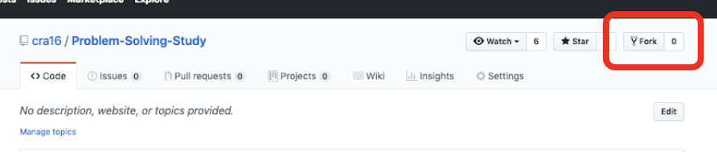
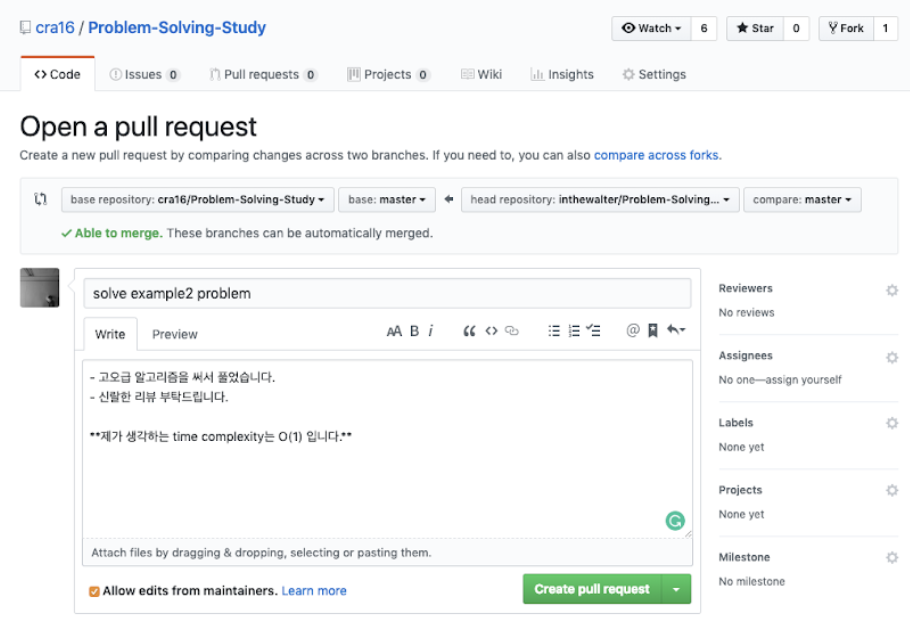

# Problem Solving Study

## HOW TO? (2019-1)
- 2주에 최소 3문제가 출제됩니다.
- 

## HOW TO SUBMIT SOLUTION

#### 1. fork cra16's repository

#### 2. clone the forked repository
```
git clone https://github.com/**your username**/Problem-Solving-Study
```
#### 3. add a remote of cra16's repository as name 'upstream'
```
git remote add upstream https://github.com/cra16/Problem-Solving-Study
```
#### 4. fetch the remote 
```
git fetch upstream
```
#### 5. merge the upstream's master branch on your origin's master
```
(optional) git checkout master
git merge master upstream/master
```
#### 6. make PR(Pull Request) in github


## HOW TO REVIEW OTHER SOLUTION
- comment on PR
