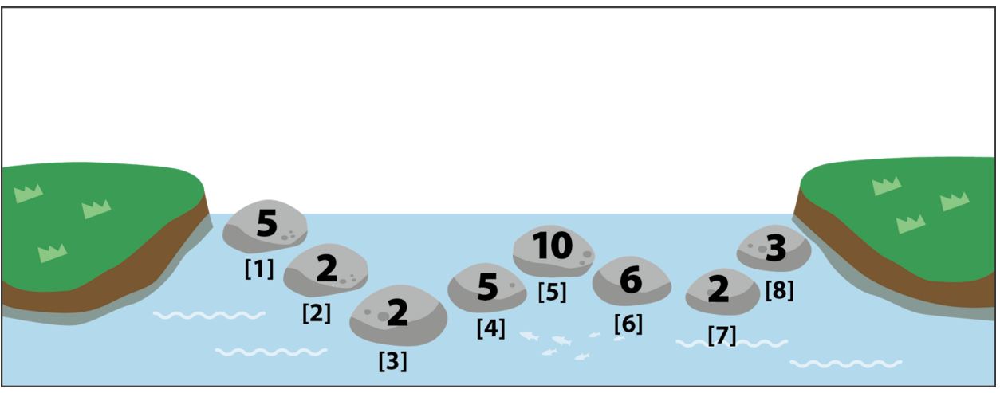

# Problem

인경호에는 연못을 가로지는 특별한 징검다리가 있다. 이 징검다리는 아래와 같은 특별한 성질을 가지고 있다.

1. 징검다리를 이루는 돌의 개수는 N개이며 돌이 놓인 순서대로 1번, 2번 ... N번의 번호가 붙어 있으며 각각의 돌에는 양의 정수가 써져있다.
2. 징검다리를 이루는 돌들의 강도는 K로 동일하며 이를 넘어가는 힘을 받으면 부서진다.
3. 매일 자정이 되면 돌의 개수 N과 돌들의 강도 K, 각각의 돌에 써져있는 양의 정수가 새롭게 바뀐다.

매일 똑같은 길로 등교하는 것이 지루했던 송이는 이 징검다리를 이용해 재미있는 놀이를 하며 등교하는 방법을 생각해 냈다. 놀이의 방법은 간단하다. 1번 돌부터 시작해 N번 돌까지 돌의 번호가 증가하는 순서대로 몇 개의 돌을 밟는다. 이 과정에서 밟은 돌에 써져있는 숫자들을 모두 곱하여 나온 수의 Trailing zero를 최대한 작게 만드는 것이다. 곱하는 수에는 1번 돌과 N번 돌에 적힌 수도 포함이 된다. (Trailing zero는 가장 낮은 자릿수부터 시작해서 연속되는 0의 개수를 의미한다. 10, 10100, 20151128은 각각 1, 2, 0의 Trailing zero를 가지고 있다.)

이 놀이에서 Trailing zero를 최소화하는 것은 매우 간단하다. 송이의 강인한 다리 힘을 이용해 1번부터 N번 돌까지 한 번에 뛰면 되기 때문이다. 하지만 그렇게 할 수 없는 이유는 징검다리를 이루는 돌들은 K가 넘어가는 힘이 가해지면 부서지기 때문이다.

징검다리에 가해지는 힘은 송이가 건너뛴 돌의 개수로 계산할 수 있다. 만약 1번 돌에서 N번 돌까지 한 번에 뛰게 되면 1번 돌에 가해지는 힘은 N-1이 된다. 만약 K가 N-1보다 작다면 1번 돌에서 N번 돌까지 한 번에 뛸 수 없고 놀이는 어려워진다.

아래 그림은 N = 8, K = 2인 경우를 나타낸다.


송이가 [1]번, [8]번을 밟으면 5 × 3 = 15가 되어 Trailing zero는 0이 된다. 하지만 K = 2이므로 이는 불가능한 경우다.

가능한 한 가지 경우로 [1]번, [2]번, [4]번, [5]번, [7]번, [8]번 순으로 돌을 밟는다면 그 값은 3000으로 Trailing zero는 3이 된다. 또 다른 가능한 경우로는 [1]번, [3]번, [4]번, [6]번, [8]번 순으로 돌을 밟는 경우이며 이때 값은 900이 되고 Trailing zero는 2가 된다. 이 순서는 Trailing zero를 최소로 만드는 순서이며 2보다 더 작은 Trailing zero를 만들어내는 순서는 존재하지 않는다.

송이는 이렇게 신나고 재미있는 놀이를 하며 등교하려 했지만 어느 날부터 돌의 개수가 기하급수적으로 많아져 최적의 경우를 찾지 못해 즐겁게 등교를 하지 못하게 되었다. 세상에서 가장 예쁜 송이를 도와 인경호의 징검다리의 상태가 주어졌을 때 Trailing zero의 길이가 최소가 되는 경우를 찾아주는 프로그램을 작성하자.


## 입력 설명 

입력의 첫 줄에는 송이가 등교하는 날의 수 T가 주어진다. 다음 줄부터 T개의 징검다리의 정보가 각각 두 줄에 걸쳐 주어진다. 징검다리의 정보 첫 줄에는 두 개의 수 N(2 ≤ N ≤ 100,000)과 K(1 ≤ K ≤ 20)가 빈칸을 구분으로 주어진다. N은 징검다리에 존재하는 돌의 개수, K는 징검다리를 이루는 돌들의 강도를 의미한다. 다음 줄에는 1번 돌부터 N번 돌까지 돌의 번호가 증가하는 순서대로 돌에 써져있는 값 Si(1 ≤ i ≤ N, 1 ≤ Si ≤ 231-1)가 주어진다.

## 출력 설명 

송이가 등교를 한 날마다 한 줄에 한 개씩 최적으로 놀이를 했을 때 구할 수 있는 Trailing zero의 수를 출력한다. 놀이는 항상 1번 돌에서 시작을 하고 N번 돌에서 끝나야 하며 돌의 번호는 증가하는 순서대로 밟아야 한다. 또한 곱하는 값에는 1번 돌과 N번 돌의 값도 포함이 되어야 한다. 또한 놀이를 최적으로 한다는 것은 Trailing zero를 가능한 작게 만드는 것을 의미한다.

### 입력 및 출력 예제

``` 
# 예제 입력1
1
8 2
5 2 2 5 10 6 2 3

# 예제 출력1
2
```

## 언어제한
- C/C++
- Python3

## 문제 출처
https://www.acmicpc.net/problem/11583
